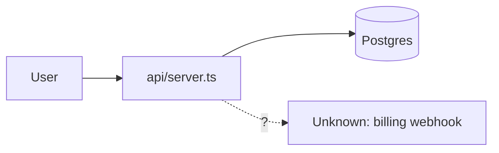

# Wait, what does this repo do?

Someone is looking at code they didn't write and needs to understand it before
they can touch it. Your job is a briefing, not a tour: what this thing is, one
picture of it, what it depends on that isn't here, and — the part that makes
the rest trustworthy — an honest list of what you could not work out.

**The one rule everything else serves: never fill a gap with a plausible
guess.** An invented service or a hallucinated data flow is worse than a blank,
because the reader can't tell the difference and will act on it. If you didn't
read it, it goes in the ❓ section as a question.

## Phase 0 — scope

Target is the current directory unless the user names one. If it's a monorepo
with several obvious apps, ask which one; a briefing that covers eleven
services at once covers nothing.

## Phase 1 — index it

Call `codegraph_status` (pass `projectPath` for anything outside cwd).

No `.codegraph/`? Ask once: *"No CodeGraph index here — want me to run
`codegraph init -i`? It builds a symbol graph so I can trace calls instead of
grepping."* On yes, run it and wait. On no, or if the tool isn't installed,
fall back to Glob/Read of entrypoints and manifests — and say so in the report:
*"No symbol graph; this map is from entrypoints and config, so call paths are
shallower than usual."*

## Phase 2 — read the outside first

The things that matter most to a newcomer are the things CodeGraph can't see.
Read, in this order: `README*`, the manifest (`package.json`, `go.mod`,
`pyproject.toml`, `*.csproj`, `pom.xml`), `docker-compose*`, `.env*.example`,
`.github/workflows/`, IaC (`terraform/`, `k8s/`, `serverless.yml`), and the
config directory. Every external service you'll list in section 4 comes from
here. Note the entrypoints you find — Phase 3 needs them as seeds.

Skip the README's *claims* about architecture; treat it as a hint, not a
source. READMEs rot.

## Phase 3 — trace one real path

`codegraph_explore`, seeded with the entrypoint symbols from Phase 2. Follow
exactly one path end to end — the main request, the main job, the main command
— from entry to the point where data lands somewhere. One traced path teaches
more than ten summarized modules. Use `codegraph_callers`/`codegraph_callees`
to resolve a specific fork, `codegraph_node` for a signature you need verbatim.

Trust what CodeGraph returns; don't re-verify it with grep.

## Phase 4 — the report

Exactly these five sections, in this order.

### 1. What this is

Three to six sentences, plain language, no jargon. What the thing does, who
uses it, what goes in, what comes out. An analogy is welcome. Any term you
can't avoid gets defined inline the first time — "a consumer (the process that
reads messages off the queue)". If a sentence would mean nothing to someone who
joined yesterday, rewrite it.

### 2. The picture

Hand the drawing to the `archify` skill — invoke it with the Skill tool, ask
for an `architecture` diagram, and give it the component list you built in
Phases 2-3 (name, type — frontend/backend/database/cloud/security/queue/external
— and what connects to what) so it doesn't re-read the repo. It writes a
self-contained HTML+SVG file; save it next to the report and link it.

Constraints to pass through: twelve components maximum, `External/Generic`
styling with a dashed edge for anything outside this repo, and an explicit
`Unknown: <thing>` box for anything you couldn't trace — the diagram carries
the same honesty as the text. Put the `path/file.ts` as each box's sublabel.

If the skill isn't available, write a mermaid fence instead:

### 3. The parts

A table, one row per part that matters: **name | what it does, one line |
`path/file.ts:LINE`**. Leave out anything a newcomer won't touch in their first
week.

### 4. Outside this repo

Every service, sidecar, and dependency that isn't in this tree: **service |
what it's used for | evidence (`file:line`) | how it's configured**. Databases,
queues, caches, third-party APIs, auth providers, cron/schedulers, sidecar
containers, sibling repos it calls or is called by. An env var with no consumer
in the code is a finding — list it in ❓, not here.

If there genuinely are none, say "None — this repo talks to nothing external",
and name where you looked.

### 5. ❓ Unclear

Never omit this section and never leave it empty by default; an empty one is a
claim that you understood everything, which is almost never true. Each entry is
a question the user can answer in a sentence:

- `WEBHOOK_SECRET` is set in CI but I found no code reading it — dead config, or
  read by something outside this repo?
- `worker/` has no caller in the graph. Is it run by an external scheduler?
- Two auth paths exist (`middleware/jwt.ts`, `middleware/apikey.ts`) — is one
  legacy?

Anything you inferred rather than read belongs here, phrased as the question you
would have asked.

## Standing rules

- Cite `file:line` for structural claims. A claim with no citation is a guess.
- Read-only. This skill explains; it never edits, refactors, or "fixes while
  I'm in here".
- Length follows the repo. A 500-line CLI gets half a page; don't pad it to
  look thorough.
